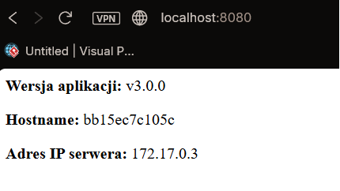

# PAwChO - Laboratorium 5

Zadanie: Wieloetapowe budowanie obrazów (Multi-stage build) z wykorzystaniem obrazu bazowego scratch oraz Nginx.

## 1. Komendy i output 

## docker build --build-arg VERSION=v3.0.0 

PS C:\Users\kacpe\lab5> docker build --build-arg VERSION=v3.0.0 -t lab5-proxy-app:v1 .
[+] Building 2.4s (17/17) FINISHED                                                                                         docker:desktop-linux
 => [internal] load build definition from Dockerfile                                                                                       0.0s
 => => transferring dockerfile: 1.97kB                                                                                                     0.0s
 => [internal] load metadata for docker.io/library/nginx:alpine                                                                            1.8s
 => [auth] library/nginx:pull token for registry-1.docker.io                                                                               0.0s
 => [internal] load .dockerignore                                                                                                          0.0s
 => => transferring context: 2B                                                                                                            0.0s 
 => [internal] load build context                                                                                                          0.0s 
 => => transferring context: 62B                                                                                                           0.0s 
 => [stage-1 1/4] FROM docker.io/library/nginx:alpine@sha256:e7257f1ef28ba17cf7c248cb8ccf6f0c6e0228ab9c315c152f9c203cd34cf6d1              0.1s 
 => => resolve docker.io/library/nginx:alpine@sha256:e7257f1ef28ba17cf7c248cb8ccf6f0c6e0228ab9c315c152f9c203cd34cf6d1                      0.0s 
 => CACHED [builder 1/7] ADD alpine-minirootfs-3.23.3-x86_64.tar.gz /                                                                      0.0s
 => CACHED [builder 2/7] RUN apk add --no-cache go                                                                                         0.0s 
 => CACHED [builder 3/7] WORKDIR /app                                                                                                      0.0s 
 => CACHED [builder 4/7] RUN echo 'package main' > main.go &&     echo 'import ("fmt"; "net/http"; "os"; "net")' >> main.go &&     echo '  0.0s 
 => CACHED [builder 5/7] RUN go build -o /my-web-app main.go                                                                               0.0s 
 => CACHED [builder 6/7] RUN echo 'server {' > /proxy.conf &&     echo '    listen       80;' >> /proxy.conf &&     echo '    server_name  0.0s 
 => CACHED [builder 7/7] RUN echo '#!/bin/sh' > /start.sh &&     echo '/usr/local/bin/my-web-app & ' >> /start.sh &&     echo 'nginx -g "  0.0s 
 => CACHED [stage-1 2/4] COPY --from=builder /my-web-app /usr/local/bin/my-web-app                                                         0.0s 
 => CACHED [stage-1 3/4] COPY --from=builder /proxy.conf /etc/nginx/conf.d/default.conf                                                    0.0s 
 => CACHED [stage-1 4/4] COPY --from=builder /start.sh /start.sh                                                                           0.0s 
 => exporting to image                                                                                                                     0.2s 
 => => exporting layers                                                                                                                    0.0s 
 => => exporting manifest sha256:a3ee0722025200ad67ad0d99678686f40de545287b1093d3df356702240459a3                                          0.0s 
 => => exporting config sha256:0f61b5a0856a07fca77d0d3ccab531438a805bd5c354f88fa1df344f85ab3d03                                            0.0s 
 => => exporting attestation manifest sha256:83d0d225637373ffa48a95914a213fb4fbd9d780596d18922d36e4429617d2af                              0.1s 
 => => exporting manifest list sha256:1b67e0dad1876c230a9d07e2b4abf8f83f786cc7a2cdf62b096e33ab0d9d9940                                     0.0s 
 => => naming to docker.io/library/lab5-proxy-app:v1                                                                                       0.0s 
 => => unpacking to docker.io/library/lab5-proxy-app:v1                                                                                    0.0s 

View build details: docker-desktop://dashboard/build/desktop-linux/desktop-linux/s5g1ob87il3s46e9wpoakvkpx

##  docker run -d -p 8080:80 --name 

PS C:\Users\kacpe\lab5> docker run -d -p 8080:80 --name proxy-test lab5-proxy-app:v1
bb15ec7c105cd1b977c7146744521ce28ec80675c0837949277c9f8740e7844e

##  curl http://localhost:8080 

PS C:\Users\kacpe\lab5> curl http://localhost:8080
                                                                                                                                                Security Warning: Script Execution Risk                                                                                                         Invoke-WebRequest parses the content of the web page. Script code in the web page might be run when the page is parsed.                               RECOMMENDED ACTION:                                                                                                                       
      Use the -UseBasicParsing switch to avoid script code execution.

      Do you want to continue?

[Y] Yes  [A] Yes to All  [N] No  [L] No to All  [S] Suspend  [?] Help (default is "N"): Y

StatusCode        : 200
StatusDescription : OK
Content           : 
<b>Wersja aplikacji:</b> v3.0.0

<b>Hostname:</b> bb15ec7c105c

<b>Adres IP serwera:</b> 172.17.0.3
        
RawContent        : HTTP/1.1 200 OK
                    Connection: keep-alive
                    Content-Length: 116
                    Content-Type: text/html; charset=utf-8
                    Date: Tue, 31 Mar 2026 20:24:32 GMT
                    Server: nginx/1.29.7

                    
<b>Wersja aplikacji:</b> v3.0.0</p...
Forms             : {}
Headers           : {[Connection, keep-alive], [Content-Length, 116], [Content-Type, text/html; charset=utf-8], [Date, Tue, 31 Mar 2026 20:24:3 
                    2 GMT]...}
Images            : {}
InputFields       : {}
Links             : {}
ParsedHtml        : mshtml.HTMLDocumentClass
RawContentLength  : 116

##  docker ps --filter name=proxy-test 

PS C:\Users\kacpe\lab5> docker ps --filter name=proxy-test
CONTAINER ID   IMAGE               COMMAND                  CREATED          STATUS                    PORTS                                    
 NAMES
bb15ec7c105c   lab5-proxy-app:v1   "/docker-entrypoint.…"   50 seconds ago   Up 49 seconds (healthy)   0.0.0.0:8080->80/tcp, [::]:8080->80/tcp   proxy-test

## Screen potwierdzający działanie aplikacji

